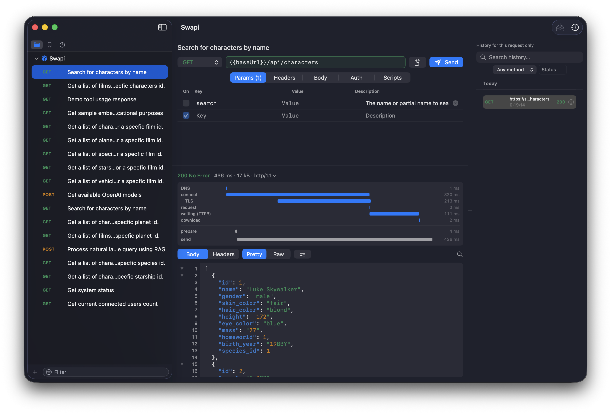

# Requester

A native macOS HTTP client. Projects of saved requests, `{{variable}}` templating,
post-response scripting, and an append-only history of every send.

SwiftUI, Swift 6 strict concurrency, **no third-party dependencies**.



## Features

- **Requests** — Params, Headers, Body (raw / form / GraphQL), Auth, and a
  post-response script. Everything autosaves.
- **Folders and favorites** — Nest requests as deep as you like. Star one with ⌘D; the
  sidebar's three tabs are the tree, your favorites, and what you sent most recently.
- **Variables** — Project-scoped `{{name}}`, substituted at send time. Fields tint green
  when every placeholder resolves and red when one doesn't, so a typo shows before you
  send rather than after.
- **Global headers** — Set once per project, sent with every request in it. A request
  that sets the same header wins.
- **Scripts** — JavaScript after the response, to chain a token into later requests:
  ```js
  variables.token = response.json().access_token
  ```
- **History** — Every send recorded, failures included. Open one and you see exactly what
  went over the wire, while the saved request keeps its template.
- **Timeline** — Where the time went: DNS, connect, TLS, time-to-first-byte, download,
  one block per redirect hop, plus the app's own stages. Stored with the entry, so an old
  send still shows it.
- **curl in and out** — Paste a `curl` command into the URL field and it becomes a
  request. Copy any request back out as a runnable one (⇧⌘C).
- **Paste repair** — Drop a JavaScript object literal into a JSON body and it becomes
  JSON: bare keys quoted, single quotes doubled, trailing commas and comments gone.
- **Import** — Postman v2.1 collections, and OpenAPI documents that re-sync without
  disturbing where you filed things.

## Requirements

macOS 26.5 or later. Xcode 26.6 to build.

## Install

Grab the zip from [Releases](https://github.com/erslee/requester.app/releases). It is
built in CI without an Apple certificate, so it is not signed or notarised and Gatekeeper
will refuse it until you clear the quarantine flag:

```sh
xattr -dr com.apple.quarantine Requester.app
open Requester.app
```

## Build

```sh
xcodebuild -project requester.xcodeproj -scheme requester \
           -configuration Debug -destination 'platform=macOS' build
```

Or open `requester.xcodeproj` and press ⌘R.

## Tests

```sh
# Unit tests — fast, no window needed
xcodebuild -project requester.xcodeproj -scheme requester \
           -destination 'platform=macOS' -only-testing:requesterTests test
```

330 unit tests (Swift Testing), plus 7 UI tests that drive the real app — drop
`-only-testing` to run both. The curl importer and exporter are tested against each
other, so the two cannot drift.

## Your data

Plain files, in the app's own container by default — no prompt, nothing to configure.
**File → Reveal Data Folder in Finder** opens it; **Change Data Folder…** points the app
at a synced folder or a git repository instead.

```
projects/<id>/project.json            metadata + global headers
projects/<id>/requests/<id>.json      one file per request
variables/<id>.json                   project variables
history/<id>/YYYY-MM.jsonl            append-only, one line per send
history/<id>/blobs/<id>.body          response bodies too large to inline
```

History is never rewritten. A script finishes after the response is already saved, so its
result is appended as a second line sharing the same id, and readers keep the last one.
Bodies over 256 KB spill to their own file and are trimmed inline, so re-reading a month
stays cheap — the viewer still shows all of it.

## Architecture

Layered, each layer depending only on the one below:

```
Views/ → State/ → Repositories/ + Domain/ → Storage/ → Models/
```

`Domain/` never imports SwiftUI and is where nearly all the tests point. `StorageBackend`
is a protocol, so a remote backend can be swapped in without touching anything above it.
`CLAUDE.md` has the rest.

## Known limitations

- **A hung script leaks a thread.** JavaScriptCore cannot be interrupted, so a script
  that never returns is timed out and reported, but its thread is abandoned until you
  quit. The boundary is "don't freeze the app", not "sandbox untrusted code".
- **Autosave is debounced 700 ms.** Quitting within that window of your last keystroke
  loses that edit.
- **Form file uploads are editable but not sent.** Only the text fields are encoded.
- **Collection import** flattens folders into names and skips pre-request scripts and
  OAuth2/digest/AWS auth — reported in the import summary rather than dropped quietly.
- **History is read in full per query.** Month files outside a date range are skipped by
  filename, but within a file every line is parsed. Fine at personal-tool volume.
